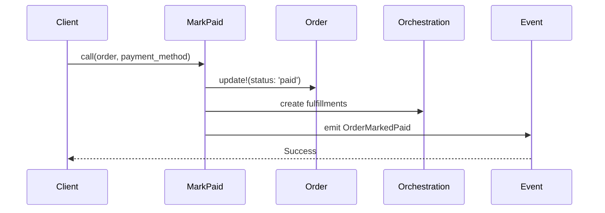

# FINAL PHASE CHECKLIST
# Project Preparation for Submission/Demo
# Date: January 19, 2026

## PHASE 1: DOCUMENTATION (Week 1)

### 1.1 README.md - Complete Overhaul
**Status:** 🔴 TODO
**Priority:** P0 (Critical)

**Required Sections:**
- [ ] Project title and description
- [ ] Problem statement / domain context
- [ ] Architectural highlights (CQRS, Service Objects, No Callbacks)
- [ ] Technology stack (Rails 8.1, SQLite, Minitest)
- [ ] Setup instructions (clone, bundle, migrate, seed, test)
- [ ] Running the app (`bin/dev`)
- [ ] Running tests (`bin/rails test`)
- [ ] Project structure overview
- [ ] Key features implemented
- [ ] Architecture decisions and trade-offs
- [ ] Future enhancements (if production)

**Template:**
```markdown
# AlShop - Commerce Platform

> A demonstration of scalable e-commerce architecture using CQRS, 
> Service Objects, and Domain-Driven Design patterns in Rails.

## 🎯 Project Overview

[Problem statement, what it solves, why it matters]

## 🏗️ Architecture Highlights

- ✅ CQRS: Strict read/write separation
- ✅ Service Objects: All business logic isolated
- ✅ No Callbacks: Explicit, predictable behavior
- ✅ Domain Events: Order lifecycle tracking
- ✅ Value Objects: Single-record calculations

## 🚀 Quick Start

[Detailed setup instructions]

## 📊 Key Features

[List implemented features with code references]

## 🧪 Testing

[How to run tests, coverage stats]
```

---

### 1.2 ARCHITECTURE.md - Deep Dive
**Status:** 🔴 TODO
**Priority:** P0 (Critical)

**Required Content:**
- [ ] CQRS pattern explanation with code examples
- [ ] Service Object pattern (Commands)
- [ ] Query Object pattern (Reads)
- [ ] Report pattern (Business Metrics)
- [ ] Value Object pattern (DetailSummary)
- [ ] Domain Events explanation
- [ ] Why no callbacks? (Rationale)
- [ ] Transaction boundaries
- [ ] Code organization principles
- [ ] Scaling considerations (reference SCALABILITY_ANALYSIS.md)

**Outline:**
```markdown
# Architecture Guide

## 1. Core Patterns

### 1.1 CQRS (Command Query Responsibility Segregation)
- Commands: app/services/orders/
- Queries: app/queries/
- Reports: app/services/revenue/

[Code examples from actual implementation]

### 1.2 Service Objects
[PricingEngine example with full code]

### 1.3 Result Pattern
[Consistent return types across all services]

### 1.4 Domain Events
[OrderMarkedPaid, OrderCancelled, OrderRefunded]

## 2. Design Decisions

### 2.1 No Callbacks
[Why we avoid ActiveRecord callbacks]

### 2.2 Explicit Transactions
[Why we wrap operations explicitly]

### 2.3 Metadata JSON vs. Normalized Tables
[Trade-offs for refunds, payment info]

## 3. File Organization
[Directory structure with explanations]
```

---

### 1.3 API_GUIDE.md - Service Object Reference
**Status:** 🔴 TODO
**Priority:** P1 (High)

**Required Content:**
- [ ] Full API for each service object
- [ ] Input parameters
- [ ] Return values (Result objects)
- [ ] Error cases
- [ ] Usage examples
- [ ] Test examples

**Template Per Service:**
```markdown
## PricingEngine

**Purpose:** Calculate final price for a sellable based on priority rules

**API:**
```ruby
result = PricingEngine.call(
  sellable: sellable,
  user: user,
  quantity: 2
)

if result.success?
  result.final_price     # => Decimal
  result.base_price      # => Decimal
  result.discount_amount # => Decimal
  result.applied_rule    # => PricingRule | nil
end
```

**Parameters:**
- `sellable` (required): Sellable record
- `user` (optional): User for user-specific pricing
- `quantity` (optional): Quantity for bulk discounts

**Returns:** Result object with:
- `success?` / `failure?` - Status
- `final_price` - Calculated price after discounts
- `errors` - Array of error messages (if failed)

**Error Cases:**
- Sellable not active
- Invalid quantity
- Price calculation errors

**Examples:**
[Full code examples from tests]
```

---

### 1.4 DEMO_SCENARIOS.md - Walkthrough Guide
**Status:** 🔴 TODO
**Priority:** P1 (High)

**Required Content:**
- [ ] End-to-end workflows with console commands
- [ ] Order creation flow
- [ ] Order payment flow
- [ ] Order cancellation flow
- [ ] Order refund flow
- [ ] Revenue reporting
- [ ] Fulfillment queue management

**Example Scenario:**
```markdown
## Scenario 1: Complete Order Lifecycle

### Step 1: Create User and Sellable
```ruby
user = User.create!(email: "demo@example.com", password: "password", role: "customer")
service = Sellable.create!(name: "Consulting", sellable_type: "Service", base_price: 500, is_active: true)
Service.create!(sellable: service, service_type: "fixed")
```

### Step 2: Create Order from Cart
```ruby
cart = Cart.create!(user: user)
CartItem.create!(cart: cart, sellable: service, quantity: 2)

result = CartToOrderService.call(cart: cart)
order = result.order
# => Order created with total_price = 1000.00
```

### Step 3: Mark Order as Paid
```ruby
result = Orders::MarkPaid.call(
  order: order,
  payment_method: "stripe",
  transaction_id: "ch_123"
)
# => Order marked paid
# => ServiceFulfillment created automatically
# => Domain event emitted
```

### Step 4: Check Fulfillment Queue
```ruby
result = Fulfillments::Queue.call(status: 'scheduled')
result.fulfillments.count # => 2 (one per order item)
result.unassigned_count   # => 2
```

### Step 5: Process Refund
```ruby
result = Orders::Refund.call(
  order: order,
  amount: 500.00,
  reason: "Customer request"
)
# => Order metadata updated with refund
# => Domain event emitted
```

### Step 6: Generate Revenue Report
```ruby
result = Revenue::Report.call(
  from_date: 1.month.ago,
  to_date: Time.current
)

result.total_revenue   # => 1000.00
result.total_refunded  # => 500.00
result.net_revenue     # => 500.00
```
```

---

## PHASE 2: SEED DATA (Week 1-2)

### 2.1 Comprehensive Seed Script
**Status:** 🔴 TODO
**Priority:** P0 (Critical)

**File:** `db/seeds.rb`

**Required Data:**
- [ ] 5-10 Users (customers, staff, admin roles)
- [ ] 3-5 Companies
- [ ] 10+ Sellables (mix of products and services)
- [ ] 5+ Product variants
- [ ] 10+ Pricing rules (various scopes and priorities)
- [ ] 20+ Orders (various states)
- [ ] 30+ Order items
- [ ] 15+ Service fulfillments (various states)
- [ ] 5+ Shipping addresses
- [ ] Metadata examples (refunds, payments, cancellations)

**Seed Script Structure:**
```ruby
# db/seeds.rb

puts "🌱 Seeding AlShop Demo Data..."

# Clear existing data (idempotent)
puts "Clearing existing data..."
[ServiceFulfillment, OrderItem, Order, CartItem, Cart, 
 ShippingAddress, PricingRule, SellableVariant, Service, 
 Product, Sellable, Company, User].each do |model|
  model.destroy_all
end

# 1. Users and Companies
puts "Creating users and companies..."
admin = User.create!(
  email: "admin@alshop.demo",
  password: "password",
  role: "admin"
)

staff1 = User.create!(
  email: "staff1@alshop.demo",
  password: "password",
  role: "staff"
)

# [Continue with comprehensive data...]

puts "✅ Seeding complete!"
puts ""
puts "Demo accounts:"
puts "  Admin: admin@alshop.demo / password"
puts "  Customer: customer1@alshop.demo / password"
puts ""
puts "Quick stats:"
puts "  Users: #{User.count}"
puts "  Orders: #{Order.count}"
puts "  Fulfillments: #{ServiceFulfillment.count}"
```

**Goal:** 
- Realistic data for demonstrations
- Covers all entity types
- Various states and edge cases
- Ready-to-demo scenarios

---

### 2.2 Seed Data Verification Script
**Status:** 🔴 TODO
**Priority:** P2 (Medium)

**File:** `lib/tasks/verify_seed.rake`

```ruby
# lib/tasks/verify_seed.rake
namespace :db do
  desc "Verify seed data integrity"
  task verify_seed: :environment do
    puts "🔍 Verifying seed data..."
    
    checks = {
      "Users exist" => User.count > 0,
      "Orders exist" => Order.count > 0,
      "All order states covered" => Order.pluck(:status).uniq.sort == %w[cancelled paid pending shipped].sort,
      "Service fulfillments exist" => ServiceFulfillment.count > 0,
      "Pricing rules exist" => PricingRule.count > 0,
      # Add more checks...
    }
    
    checks.each do |name, passed|
      puts "#{passed ? '✅' : '❌'} #{name}"
    end
  end
end
```

---

## PHASE 3: CODE POLISH (Week 2)

### 3.1 Inline Documentation
**Status:** 🟡 PARTIAL
**Priority:** P1 (High)

**Required:**
- [ ] Add RDoc comments to all service objects
- [ ] Add examples in class-level comments
- [ ] Document complex algorithms (e.g., PricingEngine priority logic)
- [ ] Add parameter descriptions
- [ ] Document return values

**Example:**
```ruby
# Service: Mark Order as Paid
#
# This service transitions an order to 'paid' status, updates payment
# metadata, triggers fulfillment orchestration for service items, and
# emits a domain event.
#
# @example Basic usage
#   result = Orders::MarkPaid.call(
#     order: order,
#     payment_method: 'stripe',
#     transaction_id: 'ch_123'
#   )
#
# @param order [Order] The order to mark as paid (must be 'pending')
# @param payment_method [String] Payment processor used
# @param transaction_id [String] External payment reference ID
#
# @return [Result] Success with order, or failure with errors
#
# @raises [ActiveRecord::RecordInvalid] If order update fails
#
module Orders
  class MarkPaid
    # [implementation]
  end
end
```

---

### 3.2 Remove Development Cruft
**Status:** 🔴 TODO
**Priority:** P2 (Medium)

**Checklist:**
- [ ] Remove commented-out code
- [ ] Remove unused files
- [ ] Remove debug `puts` statements
- [ ] Clean up `tmp/` directory
- [ ] Remove `.DS_Store` files (if any)
- [ ] Update `.gitignore` if needed

---

### 3.3 Consistent Code Formatting
**Status:** 🟢 DONE (likely)
**Priority:** P3 (Low)

**Verify:**
- [ ] Run RuboCop (if configured): `bundle exec rubocop`
- [ ] Consistent indentation (2 spaces)
- [ ] Consistent string quotes (single vs double)
- [ ] Remove trailing whitespace

---

## PHASE 4: VISUAL DOCUMENTATION (Week 2-3)

### 4.1 Architecture Diagrams
**Status:** 🔴 TODO
**Priority:** P1 (High)

**Required Diagrams:**

1. **CQRS Flow Diagram**
```
User Request
    ↓
Command Service → Write to DB → Domain Event
    ↓
Query Service → Read from DB → Result
```

2. **Order Lifecycle State Machine**
```
pending → paid → shipped
    ↓       ↓
cancelled   ↓
    ↓   refunded
```

3. **Service Object Call Chain**
```
CartToOrderService
    ↓
PricingEngine (for each item)
    ↓
Order created
    ↓
OrderPaymentService
    ↓
FulfillmentOrchestrationService
```

4. **Data Model ERD**
```
User → Order → OrderItem → Sellable
                    ↓
         ServiceFulfillment
```

**Tools:** 
- Mermaid (markdown-embeddable)
- Draw.io
- Lucidchart
- Or ASCII art in markdown

---

### 4.2 Mermaid Diagrams in Markdown
**Status:** 🔴 TODO
**Priority:** P1 (High)

**Example:**
```markdown
## Order Payment Flow


```

---

## PHASE 5: TESTING & VERIFICATION (Week 3)

### 5.1 Test Suite Health Check
**Status:** 🟢 DONE
**Priority:** P0 (Critical)

**Verify:**
- [x] All tests passing (239 tests ✅)
- [x] No pending tests
- [x] No skipped tests
- [ ] Run with warnings enabled: `RUBYOPT="-W" bin/rails test`
- [ ] Check for deprecation warnings

---

### 5.2 Test Coverage Report
**Status:** 🔴 TODO (Optional)
**Priority:** P3 (Low)

**Optional Enhancement:**
```bash
# Add SimpleCov
gem 'simplecov', require: false, group: :test

# In test_helper.rb
require 'simplecov'
SimpleCov.start 'rails'
```

---

### 5.3 Integration Test Walkthrough
**Status:** 🔴 TODO
**Priority:** P2 (Medium)

**Create:** `test/integration/order_lifecycle_test.rb`

```ruby
require "test_helper"

class OrderLifecycleIntegrationTest < ActiveSupport::TestCase
  test "complete order lifecycle from cart to refund" do
    # 1. Setup
    user = User.create!(email: "test@example.com", password: "password", role: "customer")
    service = create_service_sellable
    
    # 2. Cart to Order
    cart = Cart.create!(user: user)
    CartItem.create!(cart: cart, sellable: service, quantity: 2)
    
    result = CartToOrderService.call(cart: cart)
    assert result.success?
    order = result.order
    
    # 3. Mark Paid
    result = Orders::MarkPaid.call(
      order: order,
      payment_method: "stripe",
      transaction_id: "ch_test"
    )
    assert result.success?
    assert_equal 'paid', order.reload.status
    
    # 4. Verify Fulfillment Created
    assert_equal 2, ServiceFulfillment.where(order_item: order.order_items).count
    
    # 5. Process Refund
    result = Orders::Refund.call(
      order: order,
      amount: 500.00,
      reason: "Test refund"
    )
    assert result.success?
    
    # 6. Verify Metadata
    summary = Orders::DetailSummary.new(order: order)
    assert_equal 500.00, summary.total_refunded
  end
end
```

---

## PHASE 6: FINAL CHECKLIST (Week 3)

### 6.1 Pre-Submission Verification

**Code Quality:**
- [ ] All tests passing (239 tests)
- [ ] No TODO comments in production code
- [ ] No hardcoded credentials or API keys
- [ ] `.gitignore` configured properly
- [ ] No large files committed (check `.git/objects`)

**Documentation:**
- [ ] README.md complete and professional
- [ ] ARCHITECTURE.md explains patterns clearly
- [ ] API_GUIDE.md has all service objects documented
- [ ] DEMO_SCENARIOS.md has step-by-step walkthroughs
- [ ] Inline code comments for complex logic

**Data:**
- [ ] Seed data comprehensive and realistic
- [ ] `bin/rails db:seed` runs without errors
- [ ] Seed data covers all entity types
- [ ] Demo scenarios work with seed data

**Setup:**
- [ ] Fresh clone + setup works: `git clone → bundle → db:setup → test`
- [ ] No missing dependencies
- [ ] Clear setup instructions in README

**Polish:**
- [ ] Code consistently formatted
- [ ] No debug statements
- [ ] No commented-out code
- [ ] Clean git history (optional: interactive rebase)

---

### 6.2 Demo Preparation

**Create:** `DEMO.md` - 5-Minute Walkthrough Script

```markdown
# 5-Minute Demo Script

## Setup (30 seconds)
```bash
git clone <repo>
cd alshop
bundle install
bin/rails db:setup
```

## Demo Flow (4 minutes)

### 1. Architecture Overview (60 seconds)
- Show CQRS structure: `tree app/services app/queries`
- Explain no callbacks
- Highlight test coverage: `bin/rails test`

### 2. Service Object Demo (90 seconds)
```bash
bin/rails console
```

[Paste complete order lifecycle from DEMO_SCENARIOS.md]

### 3. Query Layer Demo (60 seconds)
- Show Orders::List pagination
- Show Revenue::Report metrics
- Show Fulfillments::Queue

### 4. Test Suite (30 seconds)
```bash
bin/rails test
# 239 tests, 532 assertions, all passing
```

## Key Talking Points
- CQRS strict separation
- Service objects encapsulate business logic
- No callbacks = predictable, testable code
- Query objects optimize for reads
- Domain events for order lifecycle
```

---

### 6.3 Video Demo Script (Optional)
**Status:** 🔴 TODO (Optional)
**Priority:** P4 (Nice to have)

**If Recording:**
- [ ] Write narration script
- [ ] Practice demo flow
- [ ] Record 5-10 minute walkthrough
- [ ] Upload to YouTube/Vimeo (unlisted)
- [ ] Link in README

---

## PHASE 7: SUBMISSION PACKAGE

### 7.1 Final Deliverables

**Repository:**
```
alshop/
├── README.md ⭐ (Professional, complete)
├── docs/
│   ├── ARCHITECTURE.md ⭐
│   ├── API_GUIDE.md ⭐
│   ├── DEMO_SCENARIOS.md ⭐
│   ├── DEMO.md (5-min script)
│   ├── SQLITE_COMPATIBILITY_AUDIT.md
│   └── SCALABILITY_ANALYSIS.md
├── app/ (Clean, documented code)
├── test/ (239 tests passing)
├── db/
│   ├── seeds.rb ⭐ (Comprehensive)
│   └── migrate/ (21 migrations)
└── .gitignore (Clean)
```

### 7.2 Submission Checklist

**Before submitting:**
- [ ] README has clear setup instructions
- [ ] All documentation is complete
- [ ] Seed data works perfectly
- [ ] Tests all pass
- [ ] Code is clean and commented
- [ ] Git history is clean (no "wip" commits)
- [ ] No sensitive data in repo
- [ ] Repository is public (if appropriate)
- [ ] License file added (MIT recommended)

---

## ESTIMATED TIMELINE

**Week 1: Documentation Foundation**
- Days 1-2: README.md, ARCHITECTURE.md
- Days 3-4: API_GUIDE.md, DEMO_SCENARIOS.md
- Day 5: Seed data creation

**Week 2: Polish & Diagrams**
- Days 1-2: Code documentation (inline comments)
- Days 3-4: Architecture diagrams
- Day 5: Integration tests

**Week 3: Final Verification**
- Days 1-2: Demo script, walkthrough practice
- Days 3-4: Fresh setup testing, bug fixes
- Day 5: Final review and submission

---

## SUCCESS CRITERIA

### Minimum Viable Submission
- ✅ Code works (tests pass)
- ✅ Setup is documented
- ✅ Architecture is explained
- ✅ Can demo 3 key workflows

### Excellent Submission
- ✅ All of above, plus:
- ✅ Comprehensive seed data
- ✅ Visual architecture diagrams
- ✅ API documentation complete
- ✅ Demo script polished

### Outstanding Submission
- ✅ All of above, plus:
- ✅ Video demo walkthrough
- ✅ Integration test coverage
- ✅ Production-quality documentation
- ✅ Clean, professional git history

---

## NOTES

**Philosophy:**
This is an architecture demonstration project. The goal is to showcase:
1. Clean separation of concerns (CQRS)
2. Testable, maintainable service objects
3. No magic, no callbacks, explicit behavior
4. Professional documentation

**Not trying to demonstrate:**
- UI/UX (no controllers/views beyond basic)
- Production deployment
- Scaling infrastructure
- Authentication/authorization (basic only)

**Focus remains on:**
Architecture, patterns, code quality, testing, documentation.
